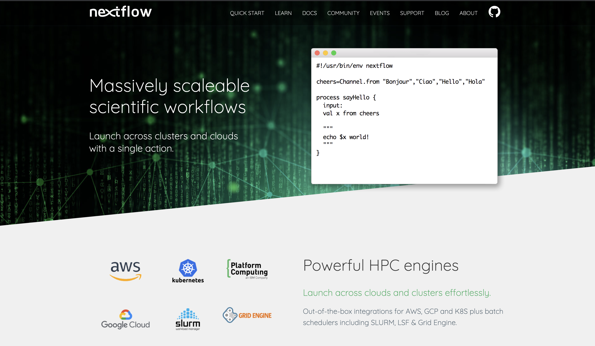

# [nextflow.io](https://nextflow.io) website



The [nextflow.io](https://nextflow.io) website is built using Hugo and is based on the _Advance_ premium Hugo theme.

## Installation

Make sure you have Hugo installed - For more information read the official [setup guide](//gohugo.io/overview/installing/) of Hugo.

## Getting started

Clone this repository and build the site:

```
$ hugo
```

You can then run the website using Hugo's built-in local server:

```
$ hugo server
```

Now enter [`localhost:1313`](http://localhost:1313) in the address bar of your browser.

## Issues
- [ ] Register for clipart account https://www.flaticon.com/
- [ ] Fix quickstart background color
- [ ] CSS for resize of support images for smaller screens
- [ ] CSS for events cards so all titles/text are aligned the same
- [ ] Home page CSS for small screens so text doesn't overlap
- [ ] Support page Tools text wrap
- [ ] Add twitter/github links icons in footer